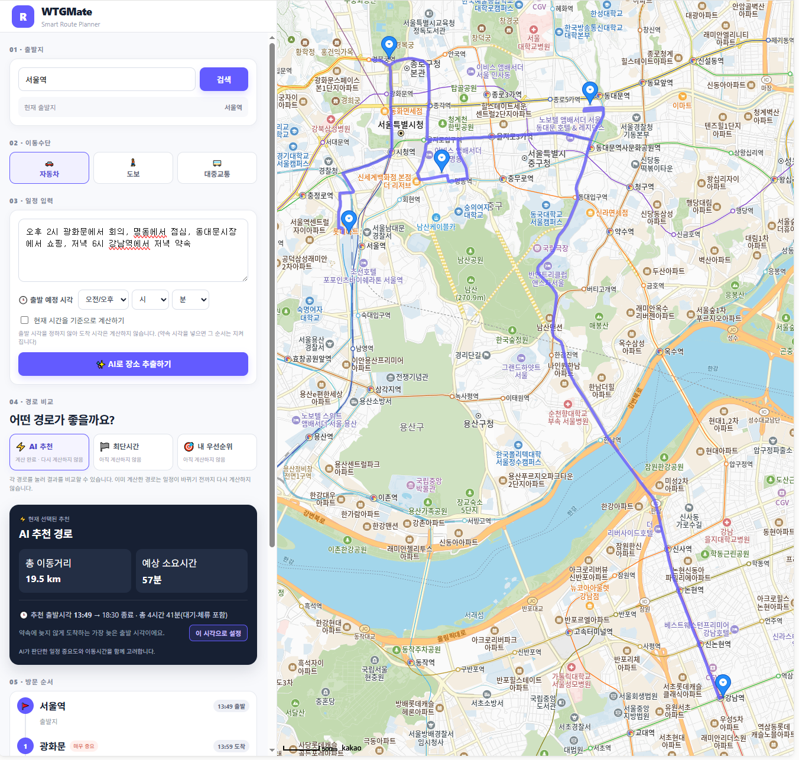

# WTGMate

Smart Route Planner. 하루 일정을 문장으로 적으면 방문할 장소를 뽑아 확인하고, 우선순위와 약속 시각, 이동수단을 반영해 방문 순서를 정해 주는 웹앱이다.

[](https://github.com/ysb2152/WTGMate/actions/workflows/ci.yml)
[](https://github.com/ysb2152/WTGMate/actions/workflows/docker-build.yml)

라이브 데모: https://wtg-mate.vercel.app

프론트엔드는 Vercel에 올려 두었다. 백엔드와 로컬 LLM은 비용을 줄이기 위해 개발용 PC에서 Cloudflare Tunnel로 띄우기 때문에, 데모를 실행 중일 때만 장소 추출과 경로 계산이 동작한다. 배포 방식은 [DEPLOY.md](DEPLOY.md)와 [deploy/CLOUDFLARE.md](deploy/CLOUDFLARE.md)에 정리했다.



## 만들게 된 이유

여러 곳을 들르는 하루 일정에서 방문 순서를 매번 직접 고민하는 것이 번거로웠다. 가장 가까운 곳부터 도는 방법은 일정의 중요도나 약속 시각을 반영하지 못한다고 봤다. 그래서 일정을 문장으로 입력하면 장소를 뽑아 주고, 중요도와 약속 시각을 함께 고려해 방문 순서를 정해 주는 도구를 만들었다.

## 주요 기능

**자연어에서 장소 추출.** "오후 2시 광화문에서 회의, 명동에서 점심, 강남역에서 저녁" 같은 문장에서 장소와 할 일, 중요도, 약속 시각을 뽑아낸다. 장소의 의미는 로컬에서 파인튜닝한 LLM이 추출하고, 모델이 답한 좌표는 신뢰하지 않고 Kakao Local로 다시 조회해 확인한다.

**세 가지 최적화 모드.** 최단시간은 이동시간만 최소화한다. 내 우선순위는 중요한 그룹을 반드시 먼저 방문하고 같은 그룹 안에서만 이동시간을 줄인다. AI 추천은 이동시간과 우선순위를 함께 반영한다.

**시간 제약.** 약속 시각과 체류 시간으로 각 장소의 도착 시각을 계산하고 지각을 알린다. 출발 시각 없이 약속만 입력하면, 약속을 지킬 수 있는 가장 늦은 출발 시각을 역산해 알려 준다.

**실제 경로 표시.** 직선이 아니라 실제 도로와 인도, 대중교통 경로로 지도에 그린다. 자동차는 Kakao Mobility, 도보는 Tmap, 대중교통은 ODsay를 사용했다. 무료 호출 한도가 적기 때문에, 방문 순서를 정할 때는 직선거리 추정으로 계산하고 실제 API는 확정된 최종 경로에만 호출한 뒤 결과를 캐시했다.

## 기술 스택

| 영역 | 사용 |
|---|---|
| Frontend | React, Vite, Kakao Maps JS SDK |
| Backend | FastAPI, OR-Tools |
| LLM | Qwen2.5-3B QLoRA 파인튜닝, GGUF로 변환해 Ollama에 등록(`wtgmate-parser`) |
| 지도/경로 API | Kakao Local·Mobility, Tmap 보행자, ODsay 대중교통 |
| 배포 | Docker, docker-compose, nginx(AWS 준비), Cloudflare Tunnel + Vercel(라이브) |

## 로컬 실행

백엔드는 다음과 같이 실행한다.

```bash
cd backend
python -m venv venv && venv\Scripts\pip install -r requirements.txt   # Windows
copy .env.example .env   # 키 입력 (KAKAO_REST_API_KEY 필수, TMAP/ODSAY는 선택)
venv\Scripts\python -m uvicorn main:app --port 8000
```

장소 추출을 쓰려면 [Ollama](https://ollama.com)를 설치하고 파인튜닝한 GGUF로 모델을 등록한다. GGUF는 용량이 커서 저장소에 포함하지 않았고 Colab 노트북으로 생성한다.

```bash
ollama create wtgmate-parser -f backend/finetune/Modelfile
```

프론트엔드는 Kakao JS 키의 도메인 때문에 5173 포트에서 실행한다.

```bash
cd frontend
npm install
copy .env.example .env   # VITE_KAKAO_JAVASCRIPT_KEY 입력
npm run dev
```

## 배포

Docker로 백엔드와 Ollama를 한 번에 띄우려면 저장소 루트에서 `docker compose up -d --build`를 실행한다. AWS EC2에 올리는 방법과 nginx, HTTPS 설정은 [DEPLOY.md](DEPLOY.md)에 단계별로 정리했다. 비용 없이 라이브로 운영하는 Cloudflare Tunnel과 Vercel 방식은 [deploy/CLOUDFLARE.md](deploy/CLOUDFLARE.md)에 있다.

## 테스트

세 최적화 모드와 스케줄 계산, 캐시 동작을 단위 테스트로 검증했다. 최적화 결과는 독립적인 완전탐색과 대조해 실제로 최적해를 내는지 확인한다. GitHub Actions에서 백엔드 테스트와 프론트 빌드, 백엔드 Docker 이미지 빌드를 자동으로 돌린다.

```bash
cd backend && python -m unittest discover -s tests -v
```

## 개발 과정

기능마다 무엇을 고민했고 왜 그렇게 정했는지, 어떤 문제를 만나 어떻게 풀었는지를 [DEVELOPMENT_JOURNEY.md](DEVELOPMENT_JOURNEY.md)에 기록했다.
